# Connecto : For a Value based healthcaresystem 🏥 💸

## Description : 

1. A complete interaction system b/w doctor and patients.
2. Schedule a desired appointment with your doctor.
3. View all your prescriptions and medical reports.
4. Register hospitals and doctors
5. Doctors can write digital prescriptions.
6. Keep track of medical bills of the patient.
7. NPS based feedback system which for patients which are approved by admin.
8. Doctor Recommendation Engine based on symptoms experienced.
9. NLP (Natural Language Based) review processing engine to analyze reviews of a doctor.


## Demonstration Video Link :  <a href="https://www.youtube.com/watch?v=JfvXUz7ba2s">https://www.youtube.com/watch?v=JfvXUz7ba2s</a>

## Tech Stack 💻
<br>

<p align="left"> 
 <a href="https://www.w3.org/html/" target="_blank" rel="noreferrer">  </a>
<a href="https://www.w3schools.com/css/" target="_blank" rel="noreferrer">  </a>  <a href="https://developer.mozilla.org/en-US/docs/Web/JavaScript" target="_blank" rel="noreferrer">  </a> <a href="https://www.python.org" target="_blank" rel="noreferrer">  </a>
<a href="https://www.djangoproject.com/" target="_blank" rel="noreferrer">  </a> 
<a href="https://www.django-rest-framework.org/" target="_blank" rel="noreferrer">  </a> 
<a href="https://pandas.pydata.org/" target="_blank" rel="noreferrer">  </a>  <a href="https://pycaret.org/" target="_blank" rel="noreferrer">  </a></p>


<br>

## Installation and Setup 🎛️

1. Install Stable version of Python from official website.
2. Install Django,Django Rest Framework, PyCaret, and Textblob libraries in python.
3. Run the folllowing command to start the server on localhost port 8000
```
python manage.py runserver
```
4. Run frontend with any static webiste hosting application.
5. You are good to go.
6. Thanks


## Screenshots of the application


Add Hospital            |  Patient Signup 
:-------------------------:|:-------------------------:
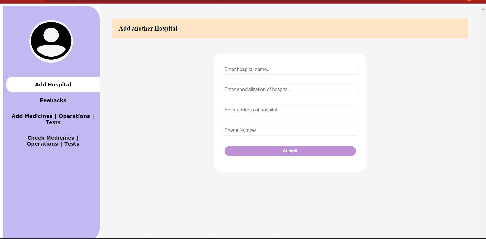  |  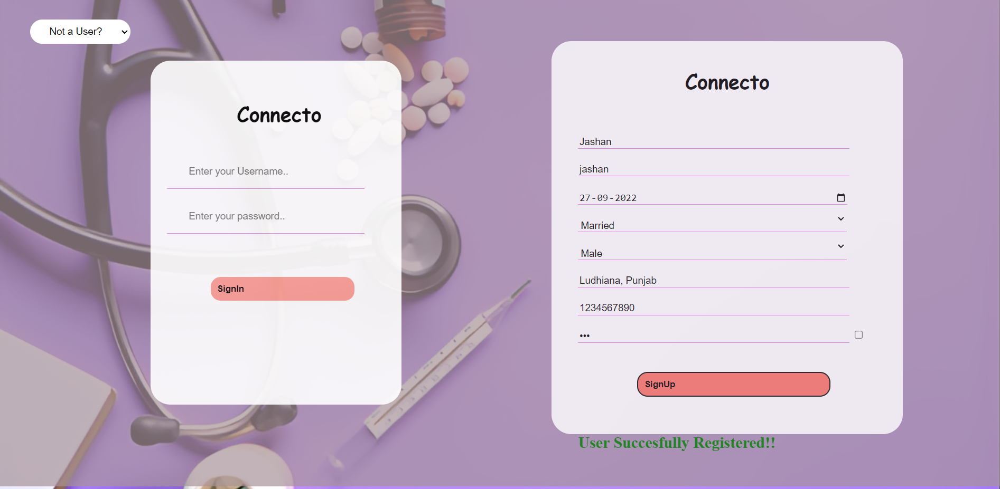


Patient Self Details            |  Doctor Add Medical Prescription
:-------------------------:|:-------------------------:
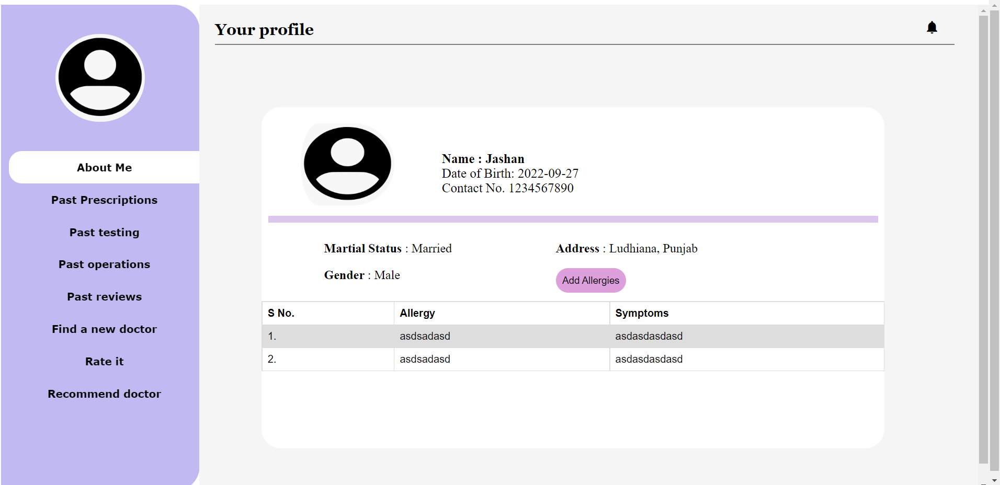  |  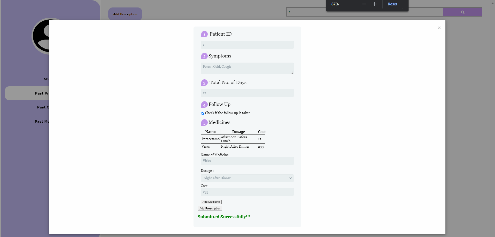

Patient View Medical Prescription            |  Patient Book Appointment with Doctor 
:-------------------------:|:-------------------------:
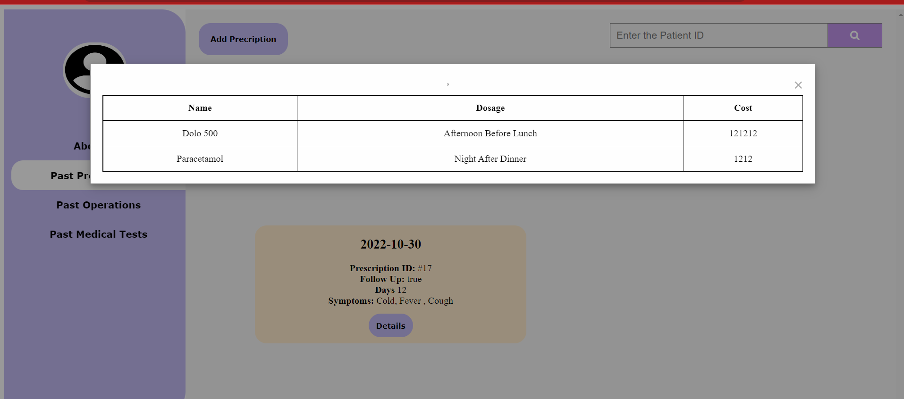  |  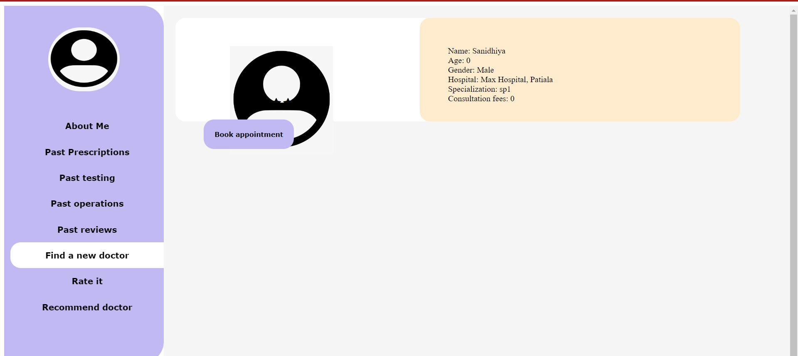

Doctor Feedback Form           |  Doctor Reviews 
:-------------------------:|:-------------------------:
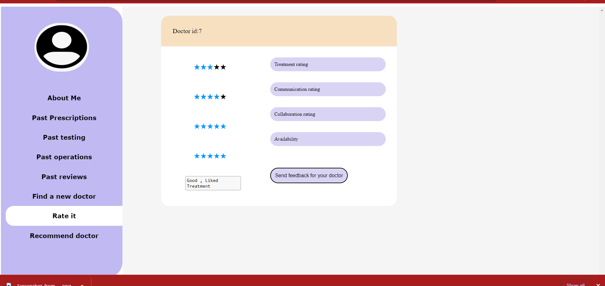  |  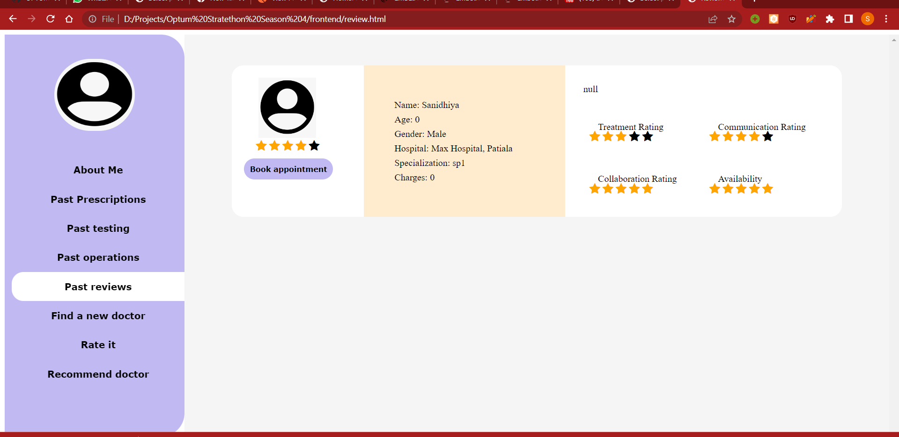

Doctor Recommendation Engine             |  Services Addition 
:-------------------------:|:-------------------------:
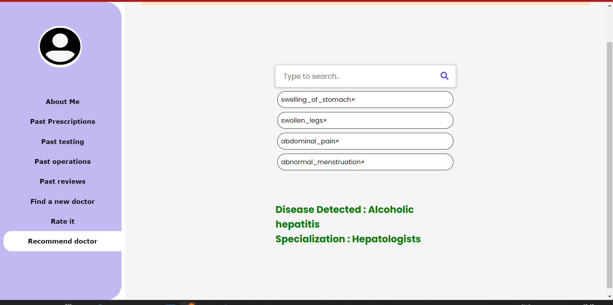  |  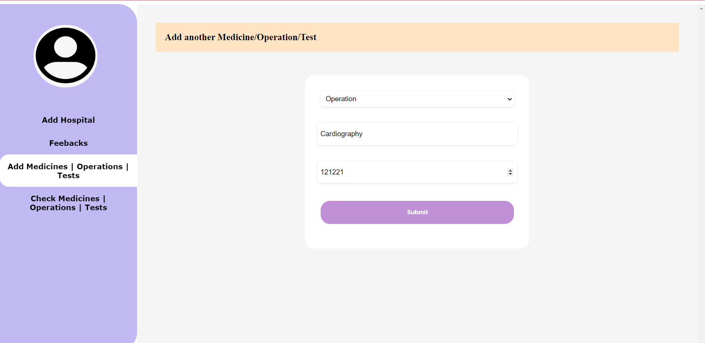

Search Doctor             |  Billings Approval
:-------------------------:|:-------------------------:
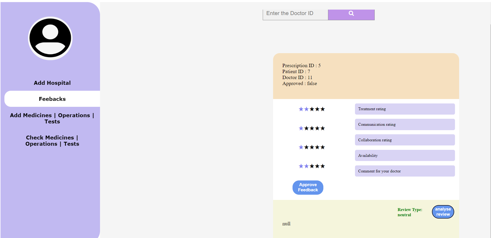  |  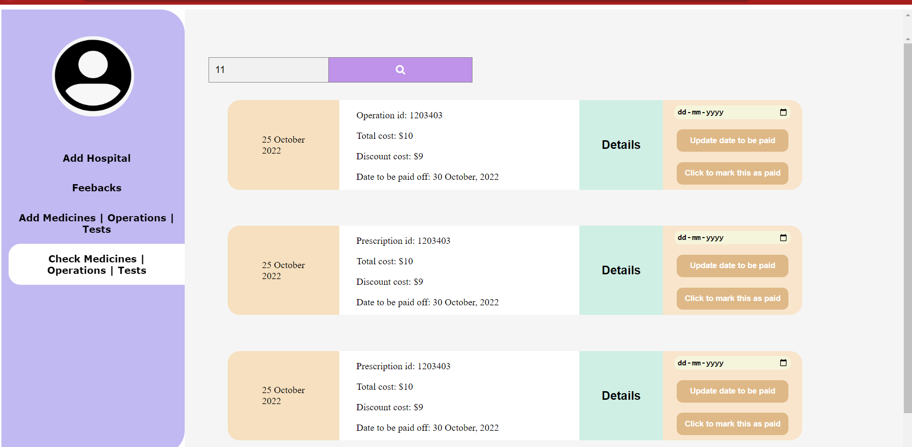


## Built by </>
## Built with ❤️
